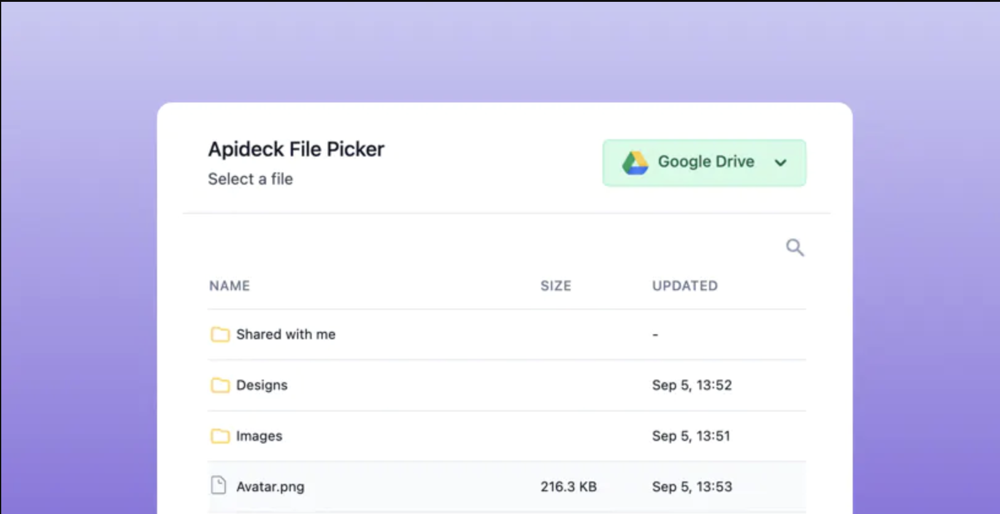

# Vue FilePicker

A Vue component to embed [Apideck FilePicker](https://www.apideck.com/samples/file-picker) in a Vue application.



[FilePicker JS](https://github.com/apideck-libraries/file-picker-js) | [React FilePicker](https://github.com/apideck-libraries/file-picker) | **Vue FilePicker**

## Installation

### Package

```sh
npm install @apideck/vue-file-picker
```

## Prerequisites

Before opening the Vault modal with `@apideck/vue-file-picker`, you need to create a Vault session from your backend using the Vault API or one of our [SDKs](https://docs.apideck.com/sdks). Find out more in the [docs](https://docs.apideck.com/apis/vault/reference#operation/sessionsCreate).

## Usage

Pass the JWT you got from the Vault session to `@apideck/vue-file-picker`, call the slot prop `open` to open the Vault modal.

```vue
<script setup lang="ts">
import { VueVault } from '@apideck/vue-file-picker';

const sessionJwt = 'REPLACE_WITH_SESSION_TOKEN';

function onSelect(file: File) {
  console.log('selected file:', file);
}
</script>

<template>
  <main>
    <VueVault
      :token="sessionJwt"
      :on-select="onSelect"
      v-slot="filePickerProps"
    >
      <button @click="filePickerProps.open()">Open</button>
    </VueVault>
  </main>
</template>
```

If you want to get notified when the modal opens and closes, you can provide the `onReady` and `onClose` options.

```vue
<script setup lang="ts">
import { VueVault } from '@apideck/vue-file-picker';

const sessionJwt = 'REPLACE_WITH_SESSION_TOKEN';

function onSelect(file: File) {
  console.log('selected file:', file);
}

function onClose() {
  console.log('closed!');
}

function onReady() {
  console.log('ready!');
}
</script>

<template>
  <main>
    <VueVault
      :token="sessionJwt"
      :on-close="onClose"
      :on-ready="onReady"
      :on-select="onSelect"
      v-slot="filePickerProps"
    >
      <button @click="filePickerProps.open()">Open</button>
    </VueVault>
  </main>
</template>
```

### Props

| Property             | Type    | Required | Default             | Description                                                           |
| -------------------- | ------- | -------- | ------------------- | --------------------------------------------------------------------- |
| token                | string  | true     | -                   | The JSON Web Token returned from the Create Session call              |
| on-select            | event   | false    | -                   | The function that gets called when a file is selected                 |
| on-connection-select | event   | false    | -                   | The function that gets called when a connection is selected           |
| title                | string  | false    | Apideck File Picker | Title shown in the modal                                              |
| subTitle             | string  | false    | Select a file       | Subtitle shown in the modal                                           |
| show-attribution     | boolean | false    | true                | Show "Powered by Apideck" in the backdrop of the modal backdrop       |
| open                 | boolean | false    | false               | Opens the file picker if set to true                                  |
| onClose              | event   | false    | -                   | Function that gets called when the modal is closed                    |
| file-to-save         | file    | false    | -                   | Forces "Upload" mode to select the folder to upload the provided file |
